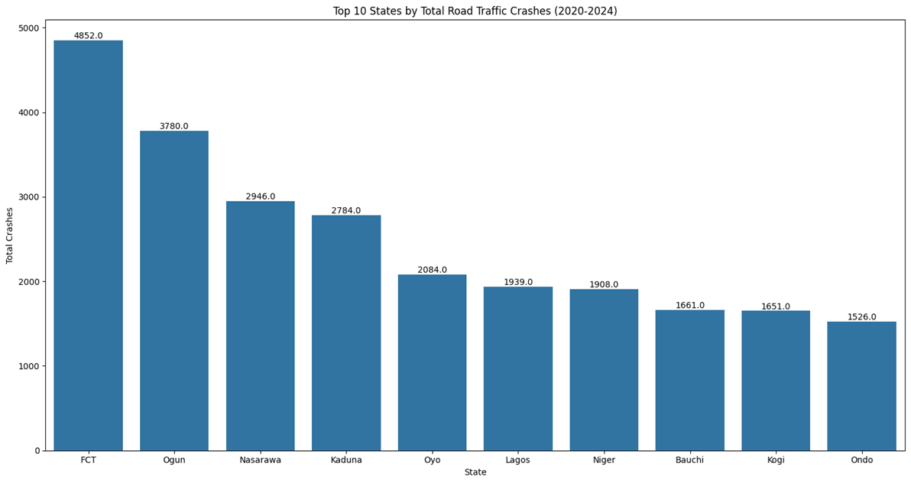
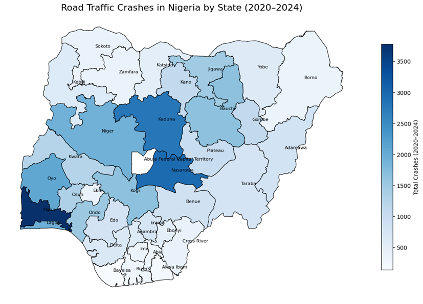
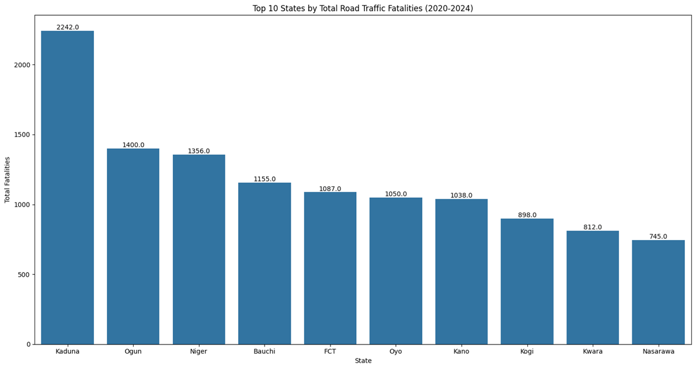
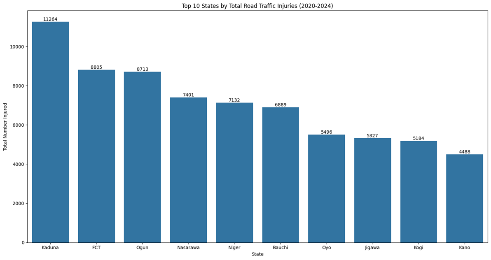
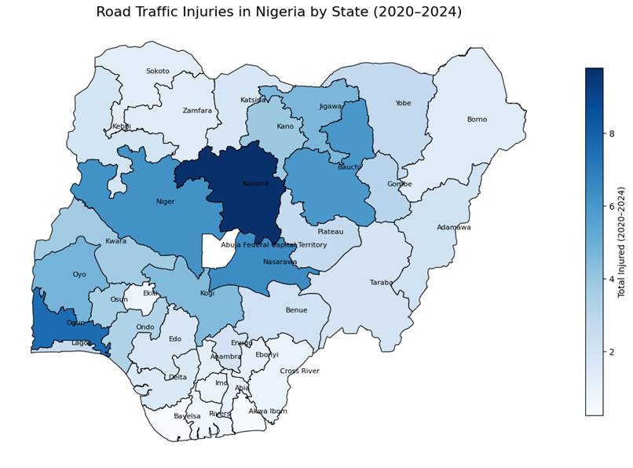

# EDA of Nigerian Road Traffic Crashes (2020-2024) 

  
  
  
  
  
  
  
  
  
  

 

 

## Project Overview 
Road traffic crashes represent a major public safety and public health concern in Nigeria, resulting in thousands of injuries and fatalities each year. Despite continuous efforts by the Federal Road Safety Commission (FRSC) to improve road safety, the persistence of these incidents highlights the need for a deeper understanding of their underlying causes and patterns. The FRSC has compiled detailed quarterly crash data covering the period from 2020 to 2024, encompassing critical variables such as the number of crashes, injuries, fatalities, vehicles involved, and key contributing factors — including speed violations, driver impairment, poor weather conditions, and fatigue.
The primary objective of this exploratory data analysis (EDA) is to analyse and identify trends, patterns, and key insights related to road traffic crashes across Nigeria’s states and quarters. Specifically, this analysis seeks to uncover temporal trends, evaluate state-by-state crash risks, and assess the impact of contributing factors on the severity of outcomes such as injuries and fatalities. By deriving data-driven insights, this study aims to support the FRSC in developing targeted road safety policies, prioritizing high-risk regions, and implementing evidence-based interventions to reduce crash rates and save lives.

## Dataset 

The [Dataset](https://www.kaggle.com/datasets/akinniyiakinwande/nigerian-traffic-crashes-2020-2024) is sourced from Kaggle. It provides a comprehensive overview of road traffic crashes across Nigeria from Q4 2020 to Q1 2024. It also captures quarterly records on crash counts, injuries, fatalities, and the number of vehicles involved, along with major contributing factors such as speeding, impaired driving, poor weather, and driver fatigue. Collected from Nigerian official traffic reports, the dataset offers valuable insights into the conditions and behaviors influencing road safety nationwide. There are no missing values in any columns. A brief outline of dataset columns are given in the following table. 

| Column                    | Description                                                                  |
| ------------------------- | ---------------------------------------------------------------------------- |
| `Quarter`                 | The quarter in which the crash data was recorded (e.g., Q4 2020, Q1 2021).   |
| `State`                   | The Nigerian state where the traffic crashes occurred.                       |
| `Total Crashes`           | The total number of road-traffic crashes reported in that quarter and state. |
| `Number Injured`          | The total number of individuals injured in the reported crashes.             |
| `Number Killed`           | The total number of fatalities resulting from the crashes.                   |
| `Total Vehicles Involved` | The total number of vehicles involved in the reported crashes.               |
| `SPV`                     | Number of crashes attributed to Speed Violations.                            |
| `DAD`                     | Number of crashes where Driving under Alcohol/Drug influence was a factor.   |
| `PWR`                     | Number of crashes attributed to Poor Weather conditions.                     |
| `FTQ`                     | Number of crashes attributed to Driver Fatigue.                              |
| `Other_Factors`           | Number of crashes by any other factors.                                      |

## Objectives 

The primary objective of this analysis is to explore and interpret road traffic crash data in Nigeria from 2020 to 2024 to uncover meaningful trends, identify high-risk locations, and understand the factors contributing to severe crash outcomes. Specifically, the analysis seeks to address the following key questions:

- State-by-State Risk Assessment: 
Which states consistently record the highest numbers of crashes, injuries, and fatalities, and which regions pose the greatest risk based on recurring crash patterns?

- Trend Analysis by Quarter and Year: 
How do crash frequencies, injury counts, and fatality rates change across different quarters and years? Are there seasonal or temporal peaks that indicate periods of elevated road-safety risk?

- Impact of Crash Factors: 
How do contributing factors such as vehicle involvement, speed violations, alcohol/drug influence, poor weather, and fatigue relate to the severity of crashes? Which factors are most strongly associated with higher injury and fatality rates?

These objectives will guide the exploratory analysis and support the FRSC in developing data-driven road-safety strategies and targeted intervention measures. 

##  Key Questions Answered 

**State by State Risk Assessment** 

The following maps and charts illustrate the Top 10 states in Nigeria by total road traffic crashes, fatalities, and injuries between 2020 and 2024, offering both a visual geographic distribution and a comparative ranking of regions most affected by road safety incidents during the five-year period. 

  
  

 

From the data visualizations, the Federal Capital Territory (FCT), Ogun, Nasarawa, and Kaduna consistently emerge among the top states with the highest total road traffic crashes between 2020 and 2024. The FCT leads significantly in total crashes (4,852), followed by Ogun (3,780) and Nasarawa (2,946). This trend suggests that these regions have high vehicular activity, possibly due to dense traffic networks, major highways, and increasing urbanization. High crash frequencies in these states indicate potential infrastructural and enforcement challenges, such as road congestion and poor traffic management systems. 

  
  

 

In terms of fatalities, Kaduna ranks the highest with 2,242 recorded deaths, followed by Ogun (1,400), Niger (1,356), and Bauchi (1,155). This indicates that crashes in these areas tend to be more severe and deadly. Kaduna’s simultaneous appearance in both the high-crash and high-fatality categories suggests a compounding safety concern where both the frequency and lethality of road incidents are elevated. Regions such as Niger and Bauchi, though lower in total crash counts, show relatively high fatality numbers, pointing to potentially dangerous road conditions or inadequate emergency response mechanisms. 

  
  

 

The pattern of road traffic injuries also highlights Kaduna as the most affected state, recording 11,264 injuries, followed by the FCT (8,805) and Ogun (8,713). This reinforces the observation that Kaduna, FCT, and Ogun are persistent hotspots for both the frequency and severity of road accidents. Other states such as Nasarawa and Niger also feature prominently across all three metrics, indicating that road safety challenges in these regions are multifaceted and systemic.

Overall, Kaduna, Ogun, FCT, and Nasarawa pose the greatest road safety risks, consistently appearing across the top categories for crashes, injuries, and fatalities. These trends suggest that targeted interventions—such as improved road infrastructure, stricter enforcement of traffic laws, and enhanced emergency response capacity—are urgently needed in these states to curb the recurring pattern of road traffic incidents.

